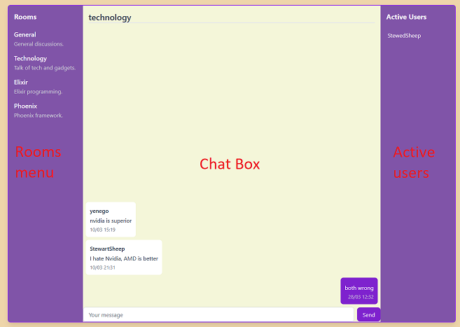

# Eorum - Phoenix Liveview social board

To access the hosted version of the application [click here](https://sea-lion-app-d3ig5.ondigitalocean.app/)\
or visit: `sea-lion-app-d3ig5.ondigitalocean.app`

## Table of contents for Phoenix LiveView project

- [Application](#application)
  - [Core Features](#core-features)
  - [Project Structure](#project-structure)
- [Technical](#technical)
  - [Chat Room](#chat-room)
  - [Thread System](#thread-system)
  - [Websockets and Channels](#websockets-and-channels)
  - [PubSub](#pubsub)
  - [Database](#database)
- [Environment Setup](#environment-setup)
- [Planned Features](#planned-features)

## Application

### Core Features

Real-time Forum Chat: Chat rooms with WebSocket-based messaging and user tracking\
 Thread Board: Create, view, delete and vote on threaded discussions\
 User Authentication: Account system with registration and login\
 Friends System: Manage friends, view their online status

### Project Structure

Authentication: Uses Phoenix's built-in generator's authentication system\
 LiveView: For UI updates without page reloads\
 PubSub: For broadcasting real-time updates across connected clients\
 Presence: Tracks friends and users online status and activity\
 Database: Uses PostgreSQL for data storage

## Technical

### Forum chat

#### Rooms

Room Names: General, Technology, Elixir, and Phoenix

Switching rooms happens by either `rooms menu` or by url paratameter handling.\
The LiveView updates with `switch_room function` in `forum_live.ex`
When switching rooms the channel connection is destroyed and new one is mounted with the correct room as payload\
Switching rooms loads the rooms latest 20 messages from the database and updates users presence info to reflect their new room

#### Messages

- Message Flow:
  `Client → Socket → Channel → Database → Broadcast → All Clients`

  1.  Client

      Message listener is mounted `in hooks.js` with a hook `in forum_live.js` on joining a chatroom\
      The message data is captured from chat_box `in forum_live.ex` input field on send event by JavaScript `forum_socket.js`

  2.  Socket

      Socket connection was initialized with the hook when user joined a chatroom\
      The message is serialized `in forum_socket.js` into JSON and sent to server channel.\
      The websocket keeps open a connection between client and server for any future messages.

  3.  Channel

      The server receives the message via the `forum` channel\
      `In forum_channel.ex` event handler for `shout` processes the incoming message\
      The channel verifies the message format and the user's permissions\
      before storing it in the database and broadcasting to other users

  4.  Database

      The Forum.create_message/1 function is called within the `shout` event handler\
      The appropriate database table is selected based on the room value (general, technology, elixir, phoenix)\
      The message is inserted into the database ensuring the message history is preserved for new users joining the chat

  5.  Broadcast

      After saving to database, the message is broadcast to all users connected to the channel.\
      Phoenix PubSub system sends the message to all users subscribed to the forum topic including the original sender (for concistency)

  6.  All clients

      Finally all connected clients receive the broadcast and render the message if the said messages room value corrospondes to the current room.\
      Messages from the current user are styled diffrently than those from others.

- Messagebox scrolling
   Scrolling is mostly handled by `Scroll` hook defined in `hooks.js`\
   It monitors the scroll position for events such as receiving new message or scrolling to the top\
   Scrolling to the top prepends 15 messages to the stream of messages.\
   Automatically scrolls to the bottom to show new messages, but only if the user is already within 30% of the bottom.

#### Active users

Active users list shows the users in the same room as yourself.\
The flow of rendering the users list is explained under [presence](#presence)

### Thread System

#### Making threads

   New threads can be created through a expandable form on the index page.\
   New thread form has real-time validation with immediate UI updates.\
   On successful post the form is reset and collapsed. On error it returns form validation errors.

#### Comments and liking

The voting system allows users to like or dislike both threads and comments if the user is authenticated.\
Comments can be added to threads. Comments are saved relationally to parent threads.

#### Sorting and paging

Sorting works based on either newest thread creation time or the number of likes and comments on a post.\
Sorting and paging both work without page reloads.

### Presence

- The Presence helper functions(adjusted) in presence.ex are copied from pragmatic studios tutorial

#### Presence from the Phoenix library is used to track chatroom users and friends

1. router puts a user_token to the session through a plug when using authenticated session

1. root.html.heex checks for the perviously mentioned token and then writes a encrpyted user_token to a meta tag

#### For chatroom tracking

3. user_socket.ex verifies the token validity and upon validation forum_channel.ex\
   starts tracking the meta tag as a authenticated user under the topic "forum"

1. forum_live.ex subscribes to the topic of "forum" to access the list of all authenticated users

1. when user navigates to the chatroom then his presence_map updates with the value of "room" which indicates what room they are browsing.\
   Next to the chatroom all the users with the corrosponding room value are displayed.

#### For friendslist tracking

3. user_socket.ex verifies the token validity and upon validation users_channel.ex\
   starts tracking the meta tag as a authenticated user under the topic "user"

1. friends_list_live.ex subscribes to the topic of "user" to access the list of all authenticated users

1. in the friends_list_live.ex users friendslist and all authenticated users are both\
   put into seperate streams and when compared to eachother list of online friends is displayed

### Database

The application uses PostgreSQL

## Environment Setup

### To start the app with Docker

Make sure you have Docker downloaded
Build and start the Docker containers from withing project folder `docker-compose up --build`

    Access the application on: [localhost:4000](http://localhost:4000)
      Terminate the Docker containers `docker-compose down`

### To start the app with local dependencies

Make sure you have Elixir: 1.17.3 and Phoenix 1.7.14
Run `mix setup` to install and setup dependencies
Start Phoenix endpoint with `mix phx.server` or inside IEx with `iex -S mix phx.server`

Now you can visit [localhost:4000](http://localhost:4000) from your browser.

## Planned Features

Thread categorization\
Direct messaging between friends\
Indepth profile creation and managment\
Possibility of posting pictures on threads and profiles\
Friendslist `away` status functionality
